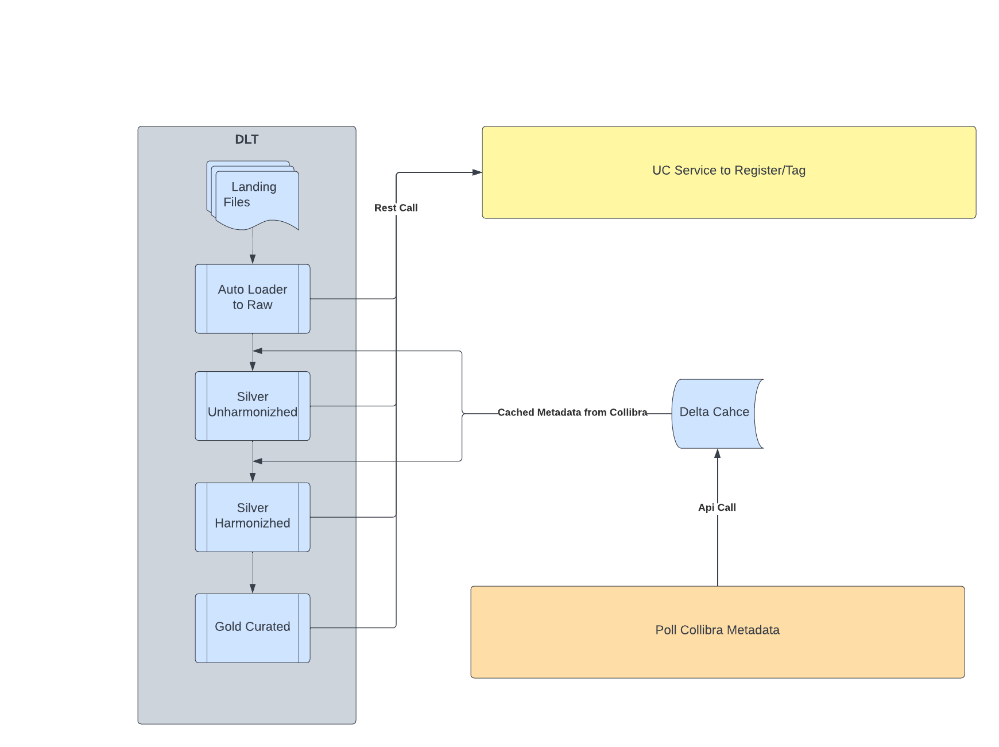

## Enterprise Data Platform Reference Pipeline

This project implements a reference pipeline for the Enterprise Data Platform (aka EDPL), the new platform in Shell that enables teams to efficiently create and share data products at scale.

NB: This project focuses on the DLT (reference) pipeline and its integration with Unity Catalog and Collibra. The integrations are minimal, the bulk of the code being around the pipeline itself.

## Guide document

To reuse and adapt the reference pipeline for your own project, read the [Guide document](./docs/guide.md). This document contains everything you need to know, create, update, and set up for your own project.

NB: we highly recommend you to read the following sections and the associated links before using the guide document so that you have the full picture when setting up your project.

## Quick primer

### EDPL architecture

EDPL relies on three core components:
- [Collibra](https://productresources.collibra.com/docs/collibra/latest/Content/Home.htm) as the business catalog where users will be able to find all data products
- [Unity Catalog](https://learn.microsoft.com/en-us/azure/databricks/data-governance/unity-catalog/) as the technical catalog where (Delta) tables will be registered
- [Delta Live Tables](https://learn.microsoft.com/en-us/azure/databricks/workflows/delta-live-tables/) (aka DLT) as the pipelining tool

EDPL Project Architecture:

### DLT pipeline

The DLT reference pipeline can be found [here](./dlt_pipelines/reference_pipeline_main.py).

## Project structure

To know more about what each file and folder does, read the [Project structure](./docs/project-structure.md) section.

The code has been factored out into a classical Python library under folder [reference_pipeline_library](./reference_pipeline_library). This improves code navigation (e.g. in an IDE) and eases the usage of unit tests. Simply put, DLT code imports and uses functions and classes created in *reference_pipeline_library*.

## Development standards

Read the [Development standards](./docs/development-standards/index.md) section to know more about our branching strategies, how we do unit testing, how we check code quality, and what our CI/CD looks like. It contains all procedures, rules, and conventions that are enforced and followed by the team.

## Python version

This project requires Python version 3.7 or higher.

## Contribution

This project welcomes suggestions and contributions.

If you have suggestions or have found bugs, open an issue with a relevant title.

If you want to contribute by fixing an issue or creating a new feature, clone the project (or fork it if you're not part of the core developing team), create a new branch, code your solution, and then open a pull request against the `dev` branch....

Please read the [Development standards](./docs/development-standards/index.md) section and the [code of conduct](./docs/CODE_OF_CONDUCT.md) before contributing.

## Maintainers

Please contact the Databricks CoE at GX-PT-IDA-DatabricksCoE@shell.com if you have any questions about this repository.
