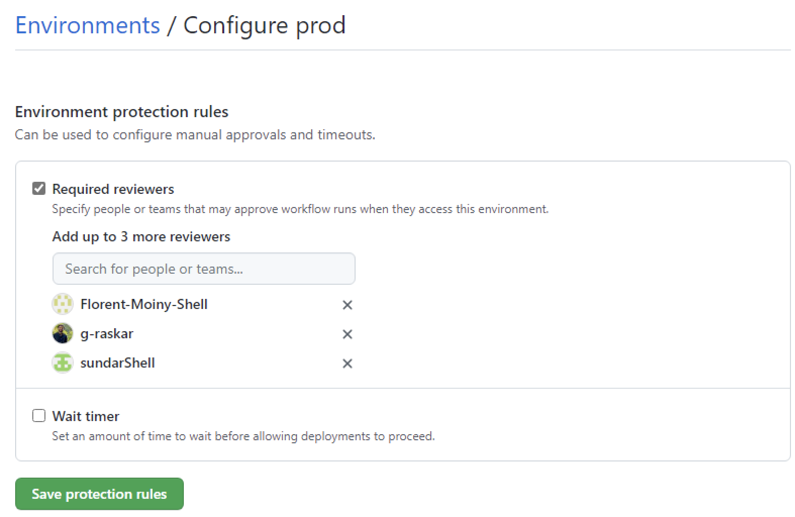
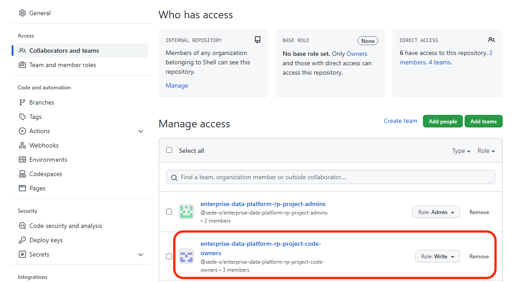

# CI/CD Setup

To properly run the CI/CD for your own project, you need a few prerequisites:
- SonarQube secrets
- GitHub environments with proper protection rules
- Databricks variables for each environment
- Azure secrets for each environment
- GitHub personal access token
- Enable SSO on those GitHub PATs
- GitHub branch protection rules
- Updated workflow files
- Updated folders and files

## SonarQube secrets 

We use SonarQube to check the quality of our code. To interact with SonarQube, we need two repository secrets in GitHub:
- *SONAR_HOST_URL*: this should be *https://sesvc.shell.com*
- *SONAR_TOKEN*: the token that you got when creating the project in SonarQube

Follow the [doc](https://docs.github.com/en/actions/security-guides/encrypted-secrets#creating-encrypted-secrets-for-a-repository) to create repository secrets in GitHub.

Read the [Code quality with SonarQube](sonarqube.md) doc to know more about how to set up SonarQube for your project, how SonarQube integrates with pytest, and the technical quirks to keep in mind when running SonarQube in the CI/CD.

## GitHub environments

We have four environments:
- *dev*: dev environment, where developers code their solutions
- *tst*: test environment, where code is sent to run integration tests when opening a pull request against *dev*
- *pre*: pre-prod environment, where code from release branches is automatically sent to be tested by the business team 
- *prd*: prod environment, where "prod" code goes

As a result, create the following environments in GitHub: *dev*, *tst*, *pre*, and *prd*.

### Add protection rules to the prod environment

We want to prevent anybody from deploying to the *prd* environment by accident. To do so, we must add protection rules to the *prd* GitHub environment.

In particular, we require at least one specific reviewer (e.g. the Lead Engineer, the Business Owner). The required reviewers will receive an email asking to review the pending deployment. [GitHub will wait for 30  days for the approval](https://docs.github.com/en/enterprise-cloud@latest/actions/managing-workflow-runs/reviewing-deployments#about-required-reviews-in-workflows). After that time, the workflow run will be automatically canceled. As soon as one of those reviewers approves, the CI/CD will resume and deploy to the *prd* environment.

Here is an example:



## Interacting with the Databricks REST API

The CI/CD deploys code, clusters, and jobs via the Databricks REST API. This requires the Databricks host url and a valid Databricks personal access token (aka PAT).

Since we use service principals (aka SPNs) to deploy code, we need to generate PATs for those SPNs. In Azure Databricks, we can't generate PAT tokens for SPNs via the REST API. Instead, we have to generate an AD token in Azure and then reuse it as a Databricks PAT.

We generate short-lived AD tokens at runtime (i.e. when the CI/CD runs).

### Databricks variables

We need to add one (GitHub environment) variable to each GitHub environment:
- *DATABRICKS_HOST*: the Databricks workspace url

NB: this is an environment variable and not an environment secret since the Databricks workspace url is not sensitive information.

### Azure secrets

We need to add three secrets to each GitHub environment:
- *TENANT_ID*: the Azure tenant id for that SPN
- *SPN_CLIENT_ID*: the service principal client id
- *SPN_CLIENT_SECRET*: the service principal client secret

## Create a GitHub personal access token and register it as a Git credential in each Databricks workspace

Deploying code to Databricks workspaces involves updating Databricks Repos. This means we need a GitHub PAT registered as a git credential in each workspace to enable the interaction between Databricks Repos and the GitHub repository.

Since we are using SPNs to deploy code, we need to register a GitHub PAT as a git credential in each workspace for each associated SPN. This can't be done via the UI, instead we must use the [Git credentials REST API](https://docs.databricks.com/dev-tools/api/latest/gitcredentials.html?searchString=&from=0&sortby=_score&orderBy=desc&pageNo=1&aggregations=%5B%5D&uid=7dc8d13f-90bb-11e9-98a5-06d762ad9a62&resultsPerPage=10&exactPhrase=&withOneOrMore=&withoutTheWords=&pageSize=10&language=en&state=1&suCaseCreate=false#operation/create-git-credential).

Here is a code snippet to do so:
```python
# make sure you "pip install requests" before running the code
import requests

ad_token = "<FILL>"
github_pat = "<FILL>"
host_url = "<FILL>"
github_username = "<FILL>"

headers = {
    "Authorization": f"Bearer {ad_token}",
}

req = requests.post(
    f"{host_url}/api/2.0/git-credentials",
    headers={
        "Authorization": f"Bearer {ad_token}",
    },
    json={
        "personal_access_token": github_pat,
        "git_username": github_username,
        "git_provider": "gitHub"
    }
)
```

Follow the [doc](https://learn.microsoft.com/en-us/azure/databricks/repos/get-access-tokens-from-git-provider#github) to create a GitHub PAT.

NB: the best practice is to use a [GitHub machine user](https://learn.microsoft.com/en-us/azure/databricks/dev-tools/ci-cd/ci-cd-sp#add-the-github-personal-access-token-for-a-github-machine-user-to-your-azure-databricks-workspace) instead of a user account, and generate a GitHub PAT for that machine user account. In our case, we're still waiting for such a machine user, so in the meantime we decided to use one of the user accounts leading the project.

## Enable SSO on those GitHub PATs

Right after generating the GitHub PAT, make sure to authorize SSO in the GitHub UI. If not, the GitHub PAT used as a git credential in Databricks will not work.

## GitHub branch protection rules

Every time a Pull Request for *dev* or *main* is created, we want at least one code owner to review it. We achieve that by adding protection rules to those two branches and adding code owners.

### Require review from code owners

For both branches, go to their [branch protection rules](https://docs.github.com/en/repositories/configuring-branches-and-merges-in-your-repository/defining-the-mergeability-of-pull-requests/managing-a-branch-protection-rule), check the `Require a pull request before merging` box and then the `Require review from Code Owners` box.

### Create a code owners team with WRITE permission

In your repository, go to `Settings`, and to `Collaborators and teams`:
- create a team that will be the owner of the code (for the reference pipeline project, we called the team *enterprise-data-platform-rp-project-code-owners*)
- add the users that will act as code owners (NB: each user must have WRITE access to the repository)
- add the team to the repository and give it WRITE access to the repository

It should look like this:


### Create a CODEOWNERS file

Create a file named CODEOWNERS inside the `.github` folder and add the following line:
```
* @<org>/<team-name>
```

NB: `<org>` and `<team-name>` are placeholders and should be replaced by your organization and your team your just created. With the reference pipeline, the full line is:
```
* @sede-x/enterprise-data-platform-rp-project-code-owners
```

This line means that everytime a Pull Request is opened and contains modifications to any part of the code (the `*`), the team code owners will be added as a reviewer to the Pull Request. Read the [doc](https://docs.github.com/en/repositories/managing-your-repositorys-settings-and-features/customizing-your-repository/about-code-owners) for more information.

## Updated workflow files

The current workflow files contain variables and values that are specific to this project. You need to update them for your own project.

### base-tests.yaml

Replace line 33
```bash
--cov=./reference_pipeline_library \
```
by
```bash
--cov=./<your-library-name> \
```

## Updated folders and files

### DLT pipelines

In your DLT pipeline notebook, replace all imports made to the `reference_pipeline_library` by your own library.

### Project structure

At the root of the project, rename folder `reference_pipeline_library` by your own library name. NB: use underscores instead of dashes in the folder name (Python convention).

### sonar-project.properties

For key `sonar.projectKey`, use the value that was provided by SonarQube when creating the project.

For key `sonar.sources`, use your library's folder name.
