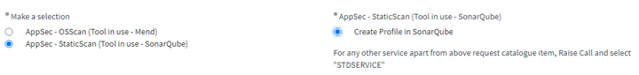

# Code quality with SonarQube

SonarQube has been chosen as the enterprise code quality tool. Note that SonarQube integrates with `pytest-cov` to reuse the code coverage report that is generated when running unit tests.

To be able to use SonarQube in our project’s GitHub Actions CI/CD, we need to:
1. Create a SonarQube project. We need to create a SNOW request to do so
2. Create GitHub secrets that will be reused by the CI/CD
3. Add a yaml file to our project to configure our SonarQube projects
4. Update the CI/CD to use the SonarQube GitHub action

## Creating a SonarQube project

To create a project in SonarQube, go to the [Application Security Services (AppSec Services-Devkit security bundle) page](https://shell2.service-now.com/sp/?id=sc_cat_item_guide&table=sc_cat_item&sys_id=2edad7d6db5760100fd1231cd3961954) and “Make a selection”:



Click on Next. On the Options menu, click on Options and:
- Provide a business justification
- As stated by the page, read the [AppSec-StaticScan Request Instructions](https://devkit.shell.com/content/tools/AppsecServicecatalog) before entering anything
- Click on “Create a Project”
- Choose an application key
- Use “Other repos (AzureDevops/GitHub)” as a Repository type
- Repository name: provide your GitHub repository's url. For example, if we were to create a SonarQube project for the dalps repository, we would provide `https://github.com/sede-x/dalps`. NB: the application key and the repository name must be different.
- Pick “SonarQube” as the application/service id
- Pick your legal entity name
- IP owned by: Click “Shell IP”
Click next. Review and submit.

## GitHub secrets – SonarQube URL and token

Once the project has been created in SonarQube, the Overview page will ask us how we want to analyze our repository. Click on GitHub Actions. The new page will guide you to configure GitHub to be able to connect to SonarQube (when running our CI/CD).
We need to create two repository secrets: SONAR_HOST_URL and SONAR_TOKEN. The SONAR_HOST_URL value will be provided to you directly in the guide. For the token, you will have to use an existing one or generate a new one. To generate a new one, simply click on the Generate a token button, choose the expired date, and copy paste the value.
Then create those two secrets by following the [doc](https://docs.github.com/en/codespaces/managing-codespaces-for-your-organization/managing-encrypted-secrets-for-your-repository-and-organization-for-github-codespaces).

The process:
- On the GitHub repository page, go to Settings
- On the left, click on Secrets and then on Actions
- On the top right, click on New repository secret

## Configuring SonarQube for our project

Following the guide, we need to add a `sonar-project.properties` file at the root of the project with, at least, one line: `sonar.projectKey=<SonarQube-project-name>`.

The project name will be provided by the guide and is the project name in SonarQube.

A few other properties are worth adding:
```text
1. sonar.sources=<my_library>
2. sonar.tests=tests
3. sonar.python.coverage.reportPaths=/github/workspace/logs/coverage.xml
4. sonar.python.xunit.reportPath=/github/workspace/logs/pytest.xml
5. sonar.python.version=3.7, 3.8, 3.9
```

NB: to understand why sonar.python.coverage.reportPaths and sonar.python.xunit.reportPath start with /github/workspace, read section `Pytest stores absolute file paths in the coverage file`. It is then followed by /logs simply because when running the unit tests with pytest, we save those files under the ./logs directory.

At a high level:
- sonar.sources: paths to directories containing main source files
- sonar.tests: paths to directories containing test source files
- sonar.python.coverage.reportPaths: path to the report file produced by the coverage tool
- sonar.python.xunit.reportPath: path to the unit test report file
- sonar.python.version: which python versions your code supports

Information on the main properties (including sonar.sources and sonar.tests) can be found in [Analysis Parameters](https://docs.sonarqube.org/latest/analysis/analysis-parameters/) under the Project Configuration section. Information on the coverage properties (including sonar.python.coverage.reportPaths) can be found in [Python Test Coverage](https://docs.sonarqube.org/latest/analysis/test-coverage/python-test-coverage/).
Information on unit test report properties (including sonar.python.xunit.reportPath) can be found in [Test Execution Parameters](https://docs.sonarqube.org/latest/analysis/test-coverage/test-execution-parameters/). Information on property sonar.python.version can be found in [Python](https://docs.sonarqube.org/latest/analysis/languages/python/).

## Using SonarQube in the CI/CD with GitHub Actions

Follow the guide to retrieve the action to use in our CI/CD. In our case, it was:
```yaml
- name: Run SonarQube
  uses: sonarsource/sonarqube-scan-action@master
  env:
    SONAR_TOKEN: ${{secrets.SONAR_TOKEN}}
    SONAR_HOST_URL: ${{secrets.SONAR_HOST_URL}}
```

As you can see, we reuse the secrets we previously created in GitHub.

NB: this action needs to run after we have run our unit tests with pytest and generated the code coverage file and the unit test report file so that SonarQube can retrieve those files.

Now, at every push, we will run all unit tests, generate coverage and unit test report files, SonarQube will pick up those files, upload the content to the webapp, and will also run all its different checks. Once it’s done, we can access the results by going to:\
`https://sesvc.shell.com/dashboard?id=<sonarqube_project_name>&branch=<branch_name>`

You should see something like this:


To reuse the results from those code quality checks back into the CI/CD, add the following action after the previous one:
```yaml
- name: Get SonarQube code quality checks results
  uses: sonarsource/sonarqube-quality-gate-action@master
  timeout-minutes: 10
  env:
   SONAR_TOKEN: ${{secrets.SONAR_TOKEN}}
   SONAR_HOST_URL: ${{secrets.SONAR_HOST_URL}}
```

## Integration between pytest and SonarQube

When running unit tests with pytest, we can create a unit test report file. By adding package pytest-cov, we can also create a coverage report file. Those two files can be imported by SonarQube to display the associated information on the SonarQube webapp. To do so, we simply need to specify, in file `sonar-project.properties`, the paths where those two files are stored by pytest.
But there is a catch with GitHub Actions, as mentioned in this [blog post](https://dev.to/remast/go-for-sonarcloud-with-github-actions-3pmn). Actually, there are two.

### Pytest runs on the runner, SonarQube in a Docker container

When pytest runs the unit tests, it will store those files in the current runner’s directory, something like `/home/runner/work/<repo_name>/<repo_name>`. To be more precise, this is the paths’ prefix, the suffix will be retrieved from the pytest command.
An example pytest command:
```text
pytest \
--cov=./reference_pipeline_library \
--cov-branch \
--cov-report term-missing \
--cov-report xml:./logs/coverage.xml \
--junit-xml=./logs/pytest.xml \
-o junit_suite_name=example-project
```

Which means that the coverage file will be stored on the runner’s file system at path `/home/runner/work/<repo_name>/<repo_name>/logs.coverage.xml`.

But the SonarQube action runs in a Docker container, and the current directory is mounted as a volume under `/github/` workspace. This is the reason why we need to have sonar.python.coverage.reportPath and sonar.python.xunit.reportPath properties start with /github/workspace.

### Pytest stores absolute file paths in the coverage file

When generating the coverage file, pytest will add an entry for each function in each file essentially, and for each function it will record its path on the file system. Since pytest runs on the runner, it will store the file paths from the runner’s file system. When SonarQube runs, it reads that coverage file and then compares the entry paths with the source file paths in the Docker volume.
Since they don’t match, SonarQube discards those entries: code coverage will not be correctly saved and displayed in the webapp.

To keep those entries, we need to update the file paths in the coverage file to match the file paths we find in the Docker volume. This is exactly the reason why, after the pytest step and before the SonarQube action, we have another step to do the switch:
```yaml
- name: update coverage file
        run: |
          sed -i "s+$GITHUB_WORKSPACE+/github/workspace+g" $GITHUB_WORKSPACE/logs/coverage.xml
```

GITHUB_WORKSPACE is the runner’s current directory and what we need to replace by /github/workspace.

## Disable code quality checks from the CI/CD

To disable code quality checks run by SonarQube from the CI/CD, comment out the following steps in [base-tests.yaml](../../.github/workflows/base-tests.yaml):
```yaml
- name: Check code quality with SonarQube
  uses: sonarsource/sonarqube-scan-action@master
  env:
    SONAR_TOKEN: ${{secrets.SONAR_TOKEN}}
    SONAR_HOST_URL: ${{secrets.SONAR_HOST_URL}}

- name: Get SonarQube code quality checks results
  uses: sonarsource/sonarqube-quality-gate-action@master
  timeout-minutes: 10
  env:
   SONAR_TOKEN: ${{secrets.SONAR_TOKEN}}
   SONAR_HOST_URL: ${{secrets.SONAR_HOST_URL}}
```

Code quality checks will not run anymore, meaning we won't see the results in the SonarQube UI and we won't take into account those results in the CI/CD.
