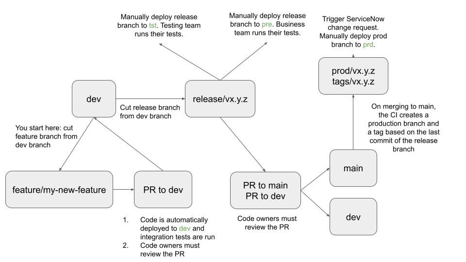
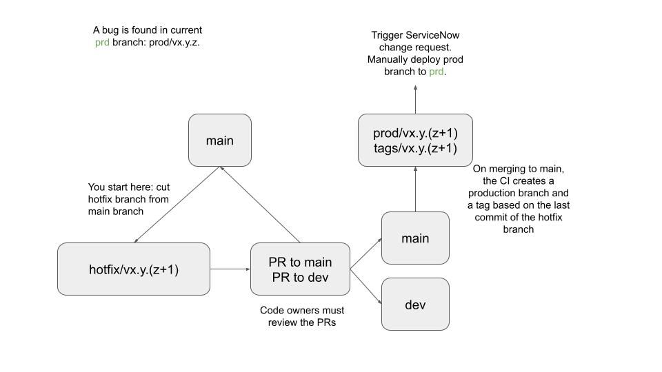

# CI/CD workflow

We follow [semantic versioning](https://semver.org/) to version our code.

## Feature and release workflow

High level overview of the CI/CD workflow when creating a release:

In detail:
1. Create a feature branch of the form `feature/<my-feature-branch>` from the *dev* branch
2. Add modifications to the feature branch\
  2.1. Unit tests and code quality checks are automatically run on each push
3. Once all modifications are done, create a Pull Request (aka PR) against the *dev* branch
4. On PR:\
  4.1. Unit tests and code quality checks are automatically run\
  4.2. The code is automatically deployed to the *dev* environment\
  4.3. The DLT pipeline, workflows, and the cluster are automatically created/updated\
  4.4. Integration tests are run\
5. Merge the PR\
  5.1. Resources in the *dev* environment for the feature branch are automatically deleted
6. Create a release branch (of the form *release/vx.y.z*) from the *dev* branch
7. On release branch creation (and every time a commit is pushed to the release branch):\
  7.1. Unit tests and code quality checks are run\
  7.2. The code is automatically deployed to the *dev* environment\
  7.3. The DLT pipeline, workflows, and the cluster are automatically created/updated\
  7.4. Integration tests are run\
8. Manually deploy the release branch to the `tst` environment
9. The testing team runs their tests in the `tst` environment
10. If tests failed in the `tst` environment:\
  10.1. The developer creates a bug fix branch from the release branch (no naming convention needed)\
  10.2. The developer creates a PR against the release branch\
  10.3. Integration tests are run automatically\
  10.4. The PR is reviewed and merged\
  10.5. The release branch is sent again to the `tst` environment to be tested by the testing team\
  10.6. This loop continues until all tests in the `tst` environment succeed\
11. If all tests passed in the `tst` environment, the testing team notifies the engineering team that the tests passed
12. The release branch is manually sent to the `pre` environment and is tested by the business team
13. If tests failed in the`pre` environment:\
  13.1. The developer creates a bug fix branch from the release branch (no naming convention needed)\
  13.2. The developer creates a PR against the release branch\
  13.3. Integration tests are run automatically\
  13.4. The PR is reviewed and merged\
  13.5. The release branch is sent again to the `tst` environment (not the `pre`, we go back from the beginning) and is tested by the testing team\
  13.6. This loop continues until all tests in the `tst` environment succeed and all tests in the `pre` environment succeed.
14. If all tests passed in the `pre` environment:\
  14.1. We create a PR from `release/vx.y.z` to `main`\
  14.2. We create a PR from `release/vx.y.z` to `dev` (to take into account the bug fixes made to the release branch)
15. We review and merge the PR in `dev`\
  15.1. Resources in the *dev* environment for the release branch are automatically deleted
16. We review and merge the PR in `main`
  16.1. `prod/vx.y.z` is automatically created based on the last commit of branch `release/vx.y.z` (that way we are sure to deploy the same codebase from `tst`, `pre`, and `prd`)\
  16.2. Tag `vx.y.z` is automatically created based on the last commit of branch `release/vx.y.z`\
  16.3. Resources in the *dev*, *tst*, and *pre* environments for the release branch are automatically deleted
17. We manually deploy branch `prod/vx.y.z` to the `prd` environment\
  17.1. The CI/CD stops and waits for the approval of at least one mandatory reviewer (e.g. the Lead Engineer or the Business Stakeholder) for 30 days. An email is sent to those people.\
  17.2. One of the mandatory reviewer accepts (or not, in that case the CI/CD fails and nothing is deployed), the CI/CD resumes\
  17.3. Code is automatically deployed to the *prd* environment\
  17.4. The DLT pipeline, workflows, and the cluster are automatically created/updated in the *prd* environment\
  17.5. Resources in the *pre* environment for the release branch are automatically deleted

## Hotfix workflow

High level overview of the CI/CD workflow when creating an hotfix:

The hotfix workflows is the following:
1. An issue is found in the current production branch `prod/vx.y.z`
2. Create an hotfix branch from `main` with the form `hotfix/vx.y.(z+1)`
3. Create a PR from the hotfix branch to `main`\
  3.1. Integration tests are run automatically in the `dev` environment
4. Create a PR from the hotfix branch to `dev` (to take into account the hotfix)
5. Merge the PR against `dev`\
  5.1. Resources in the *dev* environment for the hotfix branch are automatically deleted
6. Merge the PR against `main`\
  6.1. `prod/vx.y.(z+1)` is automatically created based on the last commit of branch `hotfix/vx.y.(z+1)`\
  6.2. Tag `vx.y.(z+1)` is automatically created based on the last commit of branch `hotfix/vx.y.(z+1)`\
  6.3. Resources in the *dev*, *tst*, and *pre* environments for the hotfix branch are automatically deleted