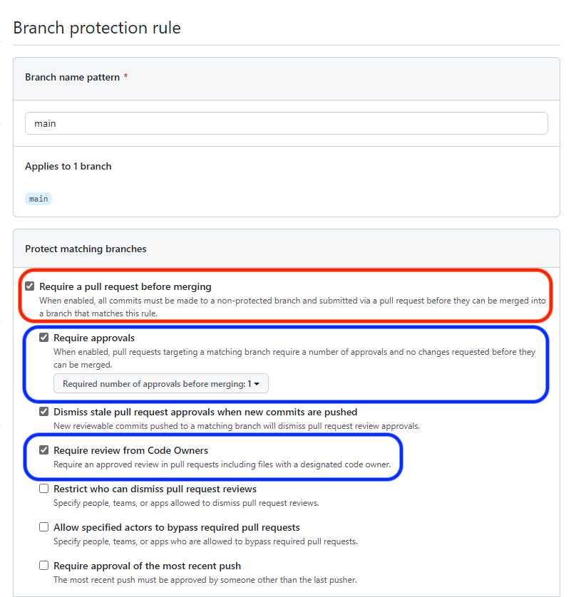
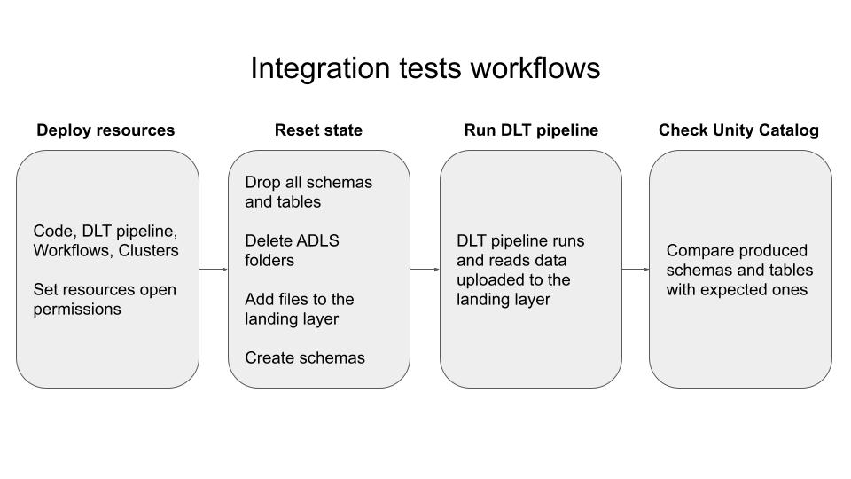

# Development standards

This section is for people who either want to contribute to this repository or want to adopt the same development standards used by the EDPL reference pipeline repository. It contains all procedures, rules, and conventions that are enforced and followed by the team.

## Setup

If you want to adopt the same development standards, rules, and CI/CD process used by this project and described in the following sections, follow the [setup page](../cicd/setup.md).

## CI/CD

We use GitHub Actions to run our CI/CD.

### CI/CD workflow

High level overview of the CI/CD workflow when creating a release:


High level overview of the CI/CD workflow when creating an hotfix:


Read the [CI/CD workflow doc page](../cicd/workflow.md) to learn more about the CI/CD at each step of the process.

## Git flow strategy

This section is tightly linked with the [CI/CD workflow](../cicd/workflow.md) section.

We use a classical git flow strategy with the following references (branches and tags):
- `dev`: where feature, release, and hotfix branches are merged
- `main`: where release and hotfix branches are merged
- `feature/*`: a new feature that will be merged to dev
- `release/v*`: a new release, cut from dev, that will be sent to the `tst` and `pre` environments and merged into main and dev
- `hotfix/v*`: a new hotfix, cut from main, that will NOT be sent to the `tst` and `pre` environments, and that will be merged into main and dev
- `prod/v*`: branches automatically created when a release or hotfix branch is merged into main. Those branches will be used in the `prd` environment. NB: Those branches are the only deviation from the classical git flow strategy, we will talk more about them in a minute.
- `tags/v*`: tags automatically created when a release or hotfix branch is merged into main. They go hand in hand with production branches. We will talk more about them in a minute.

The git flow:
1. A developer creates a feature branch from the `dev` branch and codes the new feature. Feature branches are of the form `feature/<my-feature-name>`.
2. The developer creates a pull request (aka PR) from `feature/<my-feature-name>` to `dev`
3. The PR is merged
4. Once enough features have been added to the `dev` branch, we create a release branche from the `dev` branch. Release branches are of the form `release/vx.y.z`
5. The release branch is manually sent to the `tst` environment and is tested by the testing team
6. If tests failed in the `tst` environment, the developer creates a bug fix branch from the release branch (no naming convention needed), creates a PR against the release branch, the PR is merged, the release branch is sent again to the `tst` environment and is tested by the testing team. This loop continues until all tests in the `tst` environment succeeded.
7. If all tests passed in the `tst` environment, the release branch is manually sent to the `pre` environment and is tested by the business team
8. If tests failed in the `pre` environment, the developer creates a bug fix branch from the release branch (no naming convention needed), creates a PR against the release branch, the PR is merged, the release branch is sent again to the `tst` environment (not the `pre`, we go back from the beginning) and is tested by the testing team. This loop continues until all tests in the `tst` environment succeeded and all tests in the `pre` environment succeeded.
9. If all tests passed in the `pre` environment, we create two PRs: one from `release/vx.y.z` to `main`, and one from `release/vx.y.z` to `dev`
10. We merge the PRs.
11. The CI automatically creates a prod branch of the form `prod/vx.y.z` and a tag of the form `vx.y.z`
12. We manually send the `prod/vx.y.z` branch to the `prd` environment

NB: it is very important to merge the PRs to `main` and `dev` with the "Merge pull request" button i.e. by creating a merge commit: "All commits from this branch will be added to the base branch via a merge commit". If we squash/rebase and merge, we will rewrite the commit history and we will have to deal with potentially lots of conflicts when creating PRs from release branches to the `main` branch.

### Tags vs production branches

In a classical git flox strategy, we would use tags in production. Unfortunately, Databricks currently has a known gap when displaying a tag in Databricks Repos: it displays "detached" instead of the tag nalme. This makes it difficult to know which codebase is in prod when looking in the UI.

Until Databricks fixes this gap, we decided to use long-lived production branches of the form `prod/vx.y.z` in Databricks Repos.

Once Databricks fixes this gap, we will not create and use production branches, and instead will use tags.

## Pull requests rules

1. At least one reviewer (part of the code owners team) per PR on `dev` and `main` (enforced by the `Require approvals` branch protection rule and the [CODEOWNERS](../../.github/CODEOWNERS) file)
2. Commits to the `dev` and `main` branches must come from a PR, direct commits are not allowed (enforced by the `Require a pull request before merging` branch protection rule)



## Environments

We have 4 environments:
- `dev`: dev environment, where developers code their solutions and manual and automatic integration tests are run (i.e. checking the integration of the DLT pipeline with Unity Catalog)
- `tst`: test environment, where the testing team runs their tests
- `pre`: pre-prod environment, where the business team runs their tests
- `prd`: prod environment, where production code runs

Deploying code to `dev`, `tst`, `pre`, and `prd` is done via the CI/CD.

### `dev`

The `dev` environment is where developers code their features and automatic integration tests are run (where a PR is created against branches `dev`, `main`, or `release/v*`). They can also manually deploy their branches to this environment and manually run integration tests.

By integration tests we mean checking the integration of the DLT pipeline with Unity Catalog. Collibra is out of the picture in this environment.

#### Manual deployment to `dev`

A developer can deploy their branches to the `dev` environment by [manually running](https://github.com/sede-x/enterprise-data-platform-reference-pipeline/actions/workflows/manually-deploy-to-dev.yaml) the (manual) workflow [manually-deploy-to-dev.yaml](../../.github/workflows/manually-deploy-to-dev.yaml).

To manually run the workflow:
- go to the [workflow page](https://github.com/sede-x/enterprise-data-platform-reference-pipeline/actions/workflows/manually-deploy-to-dev.yaml)
- click on `Run workflow`
- pick the branch you want to deploy
- and finally, click on the green `Run worfklow` button
- the CD will automatically trigger after a few seconds

You will then be able to see the wrapping workflow in the Databricks UI and run it manually.

NB: since GitHub Actions workflows are run by SPNs, the Databricks resources (Repos, DLT pipeline, clusters, worfklows) are owned by that SPN, and are therefore not accessible to the users by default. As a result, we added a last step in the workflow to set open permissions for all users on all those Databricks resources.

NB: we use the same naming conventions as when deploying code and resources to `tst` and `pre` to prevent conflicts. See the *Naming conventions* section below for more information.

#### Automatic deployment to `dev`

Code is automatically deployed to `dev` and integration tests are automatically run when:
- a pull request is created against `dev`, `main`, or `release/v*`
- a commit is pushed to a branch involved in an opened pull request against `dev`, `main`, or `release/v*`
- a commit is pushed to a release branch

See workflows [run-integration-tests.yaml](../../.github/workflows/run-integration-tests.yaml) and [test-release-hotfix-branch.yaml](../../.github/workflows/test-release-hotfix-branch.yaml).

#### Manual reset of `dev`

We can delete all resources deployed for a branch in `dev` by manually triggering workflow [manually-reset-dev.yaml](../../.github/workflows/manually-reset-dev.yaml).

The following resources will be deleted:
- the Repos
- the DLT pipeline
- the wrapping workflow
- the cluster used to register tables to Unity Catalog
- the workflow that registers tables to Unity Catalog
- the associated ADLS folders
- the associated Unity Catalog schemas

#### Automatic reset of `dev`

The reset of `dev` will be automatic when a pull request against `dev`, `main`, or `release/v*` is closed. See workflows [reset-env-after-merging-to-dev.yaml](../../.github/workflows/reset-env-after-merging-to-dev.yaml), [reset-env-after-merging-to-main.yaml](../../.github/workflows/reset-env-after-merging-to-main.yaml), and [reset-env-after-merging-to-release.yaml](../../.github/workflows/reset-env-after-merging-to-release.yaml).

### `tst`

The `tst` environment is where the testing team runs their tests. Deploying to this environment is done manually.

NB: only release branches of the form `release/v*` can be deployed to the `tst` environment.

#### Manually deploy to `tst` for the testing team

We can manually deploy a branch to the `tst` environment by [manually running](https://github.com/sede-x/enterprise-data-platform-reference-pipeline/actions/workflows/manually-deploy-to-tst.yaml) the (manual) workflow [manually-deploy-to-tst.yam](../../.github/workflows/manually-deploy-to-tst.yaml).

To manually run the workflow:
- go to the [workflow page](https://github.com/sede-x/enterprise-data-platform-reference-pipeline/actions/workflows/manually-deploy-to-tst.yaml)
- click on `Run workflow`
- pick the branch you want to deploy
- and finally, click on the green `Run worfklow` button
- the CD will automatically trigger after a few seconds

The testing team will then be able to see the wrapping workflow in the Databricks UI and run it manually.

NB: since GitHub Actions workflows are run by SPNs, the Databricks resources (Repos, DLT pipeline, clusters, worfklows) are owned by that SPN, and are therefore not accessible to the users by default. As a result, we added a last step in the workflow to set open permissions for all users to all those Databricks resources.

NB: when deploying to the `tst` environment for the testing team, the pipeline configuration used is the same as the one in `prd`.

#### Manual reset of `tst`

We can delete all resources deployed for a release branch in `tst` by manually triggering workflow [manually-reset-tst.yaml](../../.github/workflows/manually-reset-tst.yaml).

#### Automatic reset of `tst`

The reset of `tst` will be automatic when a pull request against `main` is closed. See workflow [reset-env-after-merging-to-main.yaml](../../.github/workflows/reset-env-after-merging-to-main.yaml).

Rationale: the release branch is merged to `main`, the space in the `tst` environment for this branch is not needed anymore, we can delete it. 

### `pre`

The `pre` environment is where the business team runs their tests.

NB: only release branches of the form `release/v*` can be deployed to the `pre` environment.

#### Manually deploy to `pre`

We manually deploy to `pre` by manually running workflow [manually-deploy-to-pre.yaml](../../.github/workflows/manually-deploy-to-pre.yaml).

#### Manual reset of `pre`

We can delete all resources deployed for a release branch in `pre` by manually triggering workflow [manually-reset-pre.yaml](../../.github/workflows/manually-reset-pre.yaml).

#### Automatic reset of `pre`

The reset of `pre` will be automatic when a pull request against `main` is closed. See workflow [reset-env-after-merging-to-main.yaml](../../.github/workflows/reset-env-after-merging-to-main.yaml).

Rationale: the release branch is merged to `main`, the space in the `pre` environment for this branch is not needed anymore, we can delete it. 

### `prd`

NB: only production branches of the form `prod/v*` can be deployed to the `prd` environment.

#### Manually deploying to `prd`

Deploying to `prd` is done manually via workflow [manually-deploy-to-prd.yaml](../../.github/workflows/manually-deploy-to-prd.yaml).

The `prd` GitHub environment requires at least one designated reviewer for the workflow to be triggered. An email is sent to the designated reviewers, and GitHub waits 30 days for at least one of them to approve the deployment. If no approval happens during the 30-day period, the workflow is cancelled. 


## Naming conventions

We mention naming conventions impacting the engineering team.

### Unity Catalog

The naming conventions for Unity Catalog are the following:
- catalog name: `<business_domain>-unitycatalog-<env>` where `env` is either `dev`, `tst`, `pre`, or `prd`
- schema names:
  - raw: `raw-<application_name>`
  - euh: `euh-<application_name>`
  - eh: `eh-<data_governance_domain>-<data_area>`
  - curated: `curated-<use_case>`

Those different values (e.g. `business_domain`) are stored in file (common_conf.json)[../../conf/common/common_conf.json] (they have to be filled by the business team for each project).

Those naming conventions are enforced by class `BaseConfig` in [base_config.py](../../reference_pipeline_library/core/base_config.py).

#### The `dev` exception

There will always be only one single deployment in environments `tst`, `pre`, and `prd`, which means that those naming conventions can be enforced.

This is however not the case in `dev` since we can have multiple features being developed and tested in parallel, which can generate conflicts when saving data to UC. To avoid those conflicts in `dev`, we append to the schemas a suffix that consists of the concatenation of the project name and the branch name.

### ADLS

There are 5 containers, one for each layer: `landing`, `raw`, `enriched-unharmonized`, `enriched-harmnonized`, and `curated`. Data is stored in each container according to the following naming conventions:
- landing: in `<confidentiality>/<project-name>_<env>`
- raw: in `<application_name>_<env>`
- enriched-unharmonized: in `<application_name>_<env>`
- enriched-harmnonized: in `<data_governance_domain>/<data_area>_<env>`
- curated: `<use_case>_<env>`

Those different values (e.g. `business_domain`) are stored in file (common_conf.json)[../../conf/common/common_conf.json] (they have to be filled by the business team for each project).

Those naming conventions are enforced by class `BaseConfig` in [base_config.py](../../reference_pipeline_library/core/base_config.py).

#### The `dev` exception

There will always be only one single deployment in environments `tst`, `pre`, and `prd`, which means that those naming conventions can be enforced.

This is however not the case in `dev` since we can have multiple features being developed and tested in parallel, which can generate conflicts when saving data to ADLS. To avoid those conflicts in `dev`, we create an intermediary folder under the "normal folder" where we will store all of our data. The name of this intermediate folder is the concatenation of the project name and the branch name.

### Databricks resources

The full reference pipeline consists of 5 parts:
- the code itself
- the DLT pipeline
- a workflow that wraps the DLT pipeline
- a workflow used to register tables to Unity Catalog (this will be removed once the integration between DLT and Unity Catalog is released)
- a cluster used by the previous workflow to register tables to Unity Catalog

When deploying code to `tst`, `pre`, and `prd`, we follow strict naming conventions based on the GitHub repository name, the branch name, and the asset. This prevents us from generating conflicts between different code bases that are deployed to those environments.

Naming conventions:
- code will be deployed at path `/Repos/<github-repo-owner>-<github-repo-name>/<branch-name>` and set to the specific branch
- the DLT pipeline is named `<github-repo-owner>-<github-repo-name>-<branch-name>-dlt`
- the wrapping workflow is named `<github-repo-owner>-<github-repo-name>-<branch-name>-workflow`
- the workflow that registers tables to UC is named `<github-repo-owner>-<github-repo-name>-<branch-name>-uc`
- the cluster used to register tables to UC is named `<github-repo-owner>-<github-repo-name>-<branch-name>-cluster`

NB: slashes in the branch name will be replaced by dashes.

NB: in the `dev` environment, deployment can happen both manually and automatically, which can generate another source of conflicts. To handle this, we add suffix `manual` or `automatic` to all previously cited resources.

For example, with the reference pipeline project:
- the GitHub Repository Owner is `sede-x`
- the GitHub Repository Name is `enterprise-data-platform-reference-pipeline`
- let's say we created a feature branch named `feature/my-new-feature`
then the name of the DLT pipeline will be:
- in `tst`, `pre`, or `prd`: `sede-x-enterprise-data-platform-reference-pipeline-feature-my-new-feature-dlt`
- in `dev` when deployed manually: `sede-x-enterprise-data-platform-reference-pipeline-feature-my-new-feature-dlt-manual`
- in `dev` when deployed automatically: `sede-x-enterprise-data-platform-reference-pipeline-feature-my-new-feature-dlt-automatic`

NB: since we have one workspace per environment, the environment name is not used in this naming convention (the workspace acts as a namespace).

## Unit testing

We use [pytest](https://docs.pytest.org/en/7.2.x/) as our unit testing framework, [pytest-cov](https://pypi.org/project/pytest-cov/) as our code coverage tool, and [chispa](https://github.com/MrPowers/chispa) to test Spark DataFrames.

To run all unit tests, compute code coverage, and save the coverage results and the unit tests results in xml files (to reuse them later with SonarQube for instance), run the following command:
```text
pytest \
--cov=./reference_pipeline_library \
--cov-branch \
--cov-report term-missing \
--cov-report xml:./logs/coverage.xml \
--junit-xml=./logs/pytest.xml \
-o junit_suite_example=reference_pipeline
```

Read the [unit testing doc page](../cicd/unit-testing.md) to learn more, and also how to disable unit tests from the CI/CD if desired.

## Code quality checks

We use SonaQube to perform code quality checks. Read the [Code quality with SonarQube](../cicd/sonarqube.md) doc to know more about how to set up SonarQube for your project, how SonarQube integrates with pytest, and the technical quirks to keep in mind when running SonarQube in the CI/CD. This doc also shows how to disable code quality checks from the CI/CD.

## Python libraries

All used external libraries must be added to the [requirements.txt](../../requirements.txt) file with their pinned versions.

Read section [Installing Python libraries when working with DLT](../cicd/installing_libraries.md) for more information on how to install local and external Python libraries, and the constraints when working with DLT.

## Integration testing

High level overview of the integration tests:


Integration tests are made of two steps:
1. we first deploy resources
2. we run a single Databricks workflow

### Deploying resources

To run the integration tests, we first need to deploy the following resources:
- the code as a Databricks Repos
- the DLT pipeline
- the (interactive) cluster registering tables in Unity Catalog
- the workflow registering tables in Unity Catalog Catalog
- the (interactive) cluster setting up the state and checking that schemas and tables are correctly populated in Unity Catalog
- the wrapping Databricks workflow

The integration test is run in the `dev` environment but deployed and triggered from the CI/CD by a service principal. This means that by default the SPN will be the owner of the resources, and the users will not be able to see the code, the resources, and the results in the UI. To handle this, we set open permissions on the code and all resources for all users in the `dev` workspace. 

### Integration test workflow

The integration test workflow contains 3 steps:
1. Set up the "environment" to start from a clean state, i.e. delete UC schemas and tables, delete all relevant folders in ADLS, upload test data to the landing folder in ADLS, create the schemas. See notebook [setup](../../integration_tests/scripts/setup.py).
2. Run the DLT pipeline. This DLT pipeline reads the uploaded test data from the landing folder. See notebook [reference_pipeline_main](../../dlt_pipelines/reference_pipeline_main.py).
3. Check that all expected schemas and tables were correctly created and filled in UC. See notebook [check_uc](../../integration_tests/scripts/check_uc.py).

Integration tests are run when a pull request is created against the `dev` branch or a release branch (or when a commit is pushed to a branch that is used in a pull request against the such branches), see step `Run integration tests` in workflow [run-integration-tests.yaml](../../.github/workflows/run-integration-tests.yaml) and the associated script [run_integration_tests_workflow.py](../../.github/scripts/run_integration_tests_workflow.py).


