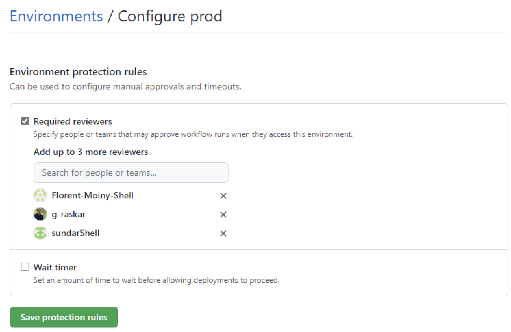

# Guide

This document will guide you on how to reuse and adapt the reference pipeline for your own project.

NB: this guide documents what needs to be created and modified for your own project, it doesn't explain the different concepts and sections of the reference pipeline. If you want to know more about those, read the [README](../README.md) and the associated links (e.g. [development standards](./development-standards/index.md)).

## Ask the Infra team to create the necessary resources for your business domain

### Datalakes and containers

For each business domain, the Infra team will create two datalakes: one business non-prod and one business prod. Write down the associated storage account names. You will reuse them when updating configuration files later.

NB: for each datalake, the Infra team will also create 6 containers: 5 for the layers (landing, raw, enriched-unharmonized, enriched-harmonized, and curated), and 1 "documents" container where Great Expectations results will be stored.

### UC catalogs

UC catalogs act at the business domain level, i.e. they encompass multiple business teams and, as a result, multiple projects. The Infra team already created all catalogs (4 catalogs per business domain, one per environment). Engineering teams won't have permissions to create catalogs, they will only be able to create schemas and tables.

NB: each catalog follows the naming convention `<business_domain>-unitycatalog-<env>`, except one, the reference products catalog, which is of the form `reference_products-unitycatalog-<env>`. This special catalog must be used by reference use cases. This is the case of the reference pipeline with the dnastats use case.

### UC external locations

The Infra team will create one external location per layer in each datalake.

NB: an external location won't be created for the landing layer. Instead, the SPNs will have direct read access permissions to the landing layer.

## Ask the Infra team to create the necessary resources for your business team

A business team owns one or more projects. Some resources will be created for the business team, meaning they will be reused across all the business team's projects.

These resources will be created the first time a business team implements a project on EDPL. Ask your business team if those resources already exist.

The Infra team will create for the business team:
- 2 AAD "Business Admin" groups: one for Business Non-Prod (for `dev`, `tst`, and `pre` environments), and one for Business Prod (for the `prd` environment)

NB: it's up to the business team to create the AAD groups for the different projects. It's also up to the business team to decide if they want to have one AAD group per project, one AAD group across all projects, or anything else.

## Ask the Infra team to create the necessary resources for your project

The Infra team will create:
- 4 Databricks workspaces, one for each environment, i.e. `dev`, `tst` (aka test), `pre` (aka pre-prod), and `prd` (aka prod)
  - those workspaces will be attached to a Unity Catalog metastore
- 2 Azure Key Vaults: one non-prd (i.e. containing secrets for the `dev`, `tst`, and `pre` environments) and one prd (i.e. containing secrets for the `prd` environment)
- 2 ADLS Gen2 storage accounts: one non-prd (i.e. containing secrets for the `dev`, `tst`, and `pre` environments) and one prd (i.e. containing secrets for the `prd` environment)
- 5 containers in each storage account: `landing`, `raw`, `enriched-unharmonized`, `enriched-harmonized`, and `curated`

## Create a GitHub repository

Create a GitHub repository, checkout the `main` branch, create a `dev` branch out of it, copy-paste the code from the reference pipeline into the `dev` branch, commit the modifications, and push the commit.

The CI/CD will be triggered and will fail when running the SonarQube action since we don't have the proper SonarQube configuration, host, and token secrets (we are going to configure all of them in a next step).

## Create a SonarQube project

To create a project in SonarQube, go to the [Application Security Services (AppSec Services-Devkit security bundle) page](https://shell2.service-now.com/sp/?id=sc_cat_item_guide&table=sc_cat_item&sys_id=2edad7d6db5760100fd1231cd3961954) and “Make a selection”:


Click on Next. On the Options menu, click on Options and:
- Provide a business justification
- As stated by the page, read the [AppSec-StaticScan Request Instructions](https://devkit.shell.com/content/tools/AppsecServicecatalog) before entering anything
- Click on “Create a Project”
- Choose an application key
- Use “Other repos (AzureDevops/GitHub)” as a Repository type
- Repository name: provide your GitHub repository's url. For example, if we were to create a SonarQube project for the dalps repository, we would provide `https://github.com/sede-x/dalps`. NB: the application key and the repository name must be different.
- Pick “SonarQube” as the application/service id
- Pick your legal entity name
- IP owned by: Click “Shell IP”
Click next. Review and submit.

Wait for a confirmation email. In the meantime, follow the next sections.

## Create 8 Azure Service Principals (with secrets)

Each environment (`dev`, `tst`, `pre`, and `prd`) needs 2 Service Principals (aka SPNs): one to deploy code and create jobs and clusters from the CI/CD, and one to own and run the actual Databricks jobs.

NB: we are currently using SPNs with secrets, but we are in the process of switching to SPNs with certificates.

### Add ADLS permissions to the `dev` SPN

The `dev` SPN owning the jobs in Databricks must have permissions "Storage Blob Data Owner" on all 5 containers so that it can delete folders in ADLS when running integration tests.

### Add Can Manage Permissions to the root Repos for each SPN in each environment

Each SPN deploying code from the CI/CD will have to create Databricks Repos in each associated environment. To be able to do this, each SPN must have "Can Manage" permissions on the root Repos.

To do so, for each environment `dev`, `tst`, `pre`, `prd`:
- go to the Databricks workspace
- click on the Repos navigation bar on the left menu, the root Repos appears
- click on the down arrow next to it, and then on Permissions
- select the specific SPN
- add Can Manage permissions
- accept

## Fill Key Vault values & Update conf files

Configuration files `conf.yaml` in [dev](../conf/dev/conf.json), [tst](../conf/tst/conf.json), [pre](../conf/pre/conf.json), and [prd](../conf/prd/conf.json) contain Azure Key Vault keys used to retrieve the associated secret values in the Key Vaults. You need to create those secrets in each Key Vault.

NB: there are only two Key Vaults: one non-prd (i.e. containing secrets for the `dev`, `tst`, and `pre` environments) and one prd (i.e. containing secrets for the `prd` environment).

For each environment:
- create a specific scope in the associated Key Vault and add it to field `kv_key` in the associated conf file
- create the associated secrets for the following fields:
  - **spn_client_id_key**: the name of the SPN used in the CI/CD
  - **spn_client_secret_key**: the secret key of the SPN used in the CI/CD
  - **storage_account**: the name of the storage account used to store data
  - **edc_user_id_key**: the Collibra user id used to call the Collibra REST API
  - **edc_user_pwd_key**: the Collibra user password used to call the Collibra REST API
  - **api_url**: the Collibra REST API url
  - **azure_connection_string_key**: the Azure connection string used by Great Expectations when storing results in ADLS
  
For instance, for the reference pipeline, we get the following `tst` [conf.json](../conf/tst/conf.json) file:
```json
{
    "env": "tst",
    "kv_key": "kv_tst",
    "spn_client_id_key": "AZ-AS-SPN-PITS-TST-CLIENT-ID",
    "spn_client_secret_key": "AZ-AS-SPN-PITS-TST-CLIENT-SECRET",
    "storage_account": "azdna112eunadlslifbtpjzn",
    "edc_user_id_key": "AZ-AS-COB-EDPL-DEV-USERNAME",
    "edc_user_pwd_key": "AZ-AS-COB-EDPL-DEV-PASSWORD",
    "api_url": "https://shell-dev.collibra.com/rest/2.0/outputModule/export/json",
    "azure_connection_string_key": "AZ-AS-EDPL-DEV-GEIO-STORAGE-CONNECTION-STRING"
}
```

## Configure GitHub Environments

### Create four GitHub environments

- *dev*: dev environment, where developers code their solutions and integration tests are run (manually or automatically)
- *tst*: test environment, where release branches are sent and where the testing team will run their tests
- *pre*: pre-prod environment, where release branches are sent and where the business team will run their tests
- *prd*: prod environment, where "prod" code goes

### Add variables and secrets for each GitHub environment

Create one variable:
- `DATABRICKS_HOST`: the Databricks workspace url for that environment

Create three secrets for the SPN that will be used for this environment by the CI/CD:
- *SPN_CLIENT_ID*: the SPN client id
- *SPN_CLIENT_SECRET*: the SPN client secret
- *TENANT_ID*: the Azure tenant id for that SPN

### Add protection rules to the `tst` environment

Under "deployment branches", allow only branches `release/v*` and `main`. This means that only release branches and the main branch can deploy to the `tst` environment. Later, we will allow only a few selected people to create release branches, which in effect will drastically prevent people from pushing anything to the `tst` environment.

### Add protection rules to the `pre` environment

Under "deployment branches", allow only branches `release/v*` and `main`. This means that only release branches and the main branch can deploy to the `pre` environment. Later, we will allow only a few selected people to create release branches, which in effect will drastically prevent people from pushing anything to the `pre` environment.

### Add protection rules to the `prd` environment

Under "deployment branches", allow only the `prod/v*` branches. This means that only the `prod/v*` branches can deploy code to the `prd` environment.

Under `Environment protection rules`, click on "required reviewers" and then add the desired required reviewers (e.g. the Lead Engineer, the Business Owner). The required reviewers will receive an email asking to review the pending deployment. [GitHub will wait for 30  days for the approval](https://docs.github.com/en/enterprise-cloud@latest/actions/managing-workflow-runs/reviewing-deployments#about-required-reviews-in-workflows). After that time, the workflow run will be automatically canceled. As soon as one of those reviewers approves, the CI/CD will resume and deploy to the *prd* environment.

Here is an example:



## Create a Git credential in each Databricks workspace

Deploying code to Databricks workspaces involves updating Databricks Repos. This means we need a GitHub PAT registered as a git credential in each workspace to enable the interaction between Databricks Repos and the GitHub repository.

### Create a GitHub personal access token

NB: the best practice is to use a [GitHub machine user](https://learn.microsoft.com/en-us/azure/databricks/dev-tools/ci-cd/ci-cd-sp#add-the-github-personal-access-token-for-a-github-machine-user-to-your-azure-databricks-workspace) instead of a user account, and generate a GitHub PAT for that machine user account. In our case, we're still waiting for such a machine user, so in the meantime we decided to use the account of one of the user leading the project, generate a GitHub for that user, and then reuse that same GitHub PAT across all 4 environments.

Follow the [doc](https://learn.microsoft.com/en-us/azure/databricks/repos/get-access-tokens-from-git-provider#github) to create a GitHub PAT.

### Enable SSO on this GitHub PAT

Right after generating the GitHub PAT, make sure to authorize SSO in the GitHub UI. If not, the GitHub PAT used as a git credential in Databricks will not work.

### Create a Git credential in each Databricks workspace for each SPN deploying code

We are using four SPNs to deploy code in all four environments, as a result we need to register the GitHub PAT as a git credential in each workspace for each associated SPN.

This can't be done via the UI, instead we must use the [Git credentials REST API](https://docs.databricks.com/dev-tools/api/latest/gitcredentials.html?searchString=&from=0&sortby=_score&orderBy=desc&pageNo=1&aggregations=%5B%5D&uid=7dc8d13f-90bb-11e9-98a5-06d762ad9a62&resultsPerPage=10&exactPhrase=&withOneOrMore=&withoutTheWords=&pageSize=10&language=en&state=1&suCaseCreate=false#operation/create-git-credential).

NB: When calling the Databricks REST API, the request is expected to provide the Databricks host url and the Databricks PAT token of the user making the call. Since we are making the call for an SPN, we need to provide a Databricks PAT for that SPN. But we can't create a Databricks PAT on behalf of an SPN, instead we need to generate an AD token for that SPN and reuse that AD token in the request as if it were a Databricks PAT token.

NB: To generate an AD token, first install the necessary dependencies in any python environment (e.g. in a Databricks notebook):
```
pip install requests msal cryptography
```
and then use class `AzureSPN` or `AzureSPNWithCertificate` in file [spn.py](../reference_pipeline_library/helpers/spn.py) to generate an AD token for an SPN with secret of an SPN with certificate.

Here is a code snippet that registers a git credential for an SPN (NB: the SPN must already be a Databricks user before running this command):
```python
# make sure you "pip install requests" before running the code
import requests

ad_token = "<FILL>"  # the SPN AD token
github_pat = "<FILL>"
host_url = "<FILL>"
github_username = "<FILL>"

headers = {
    "Authorization": f"Bearer {ad_token}",
}

req = requests.post(
    f"{host_url}/api/2.0/git-credentials",
    headers={
        "Authorization": f"Bearer {ad_token}",
    },
    json={
        "personal_access_token": github_pat,
        "git_username": github_username,
        "git_provider": "gitHub"
    }
)
```

## Add GitHub branch protection rules

Create new branch protection rules for the following branches: `dev`, `main`, `release/v*`, `prod/v*`, and `hotfix/v*`.

### Create branch protection rules for branch `main`

Under "Protect matching branches", click on:
- Require a pull request before merging
  - Require approvals: at least 1 approver
  - Dismiss stale pull request approvals when new commits are pushed
  - Require review from Code Owners
- Require status checks to pass before merging
  - Require branches to be up to date before merging
- Restrict who can push to matching branches
  - then add people or teams who can push directly to the branch

### Create branch protection rules for branch `dev`

Under "Protect matching branches", click on:
- Require a pull request before merging
  - Require approvals: at least 1 approver
  - Dismiss stale pull request approvals when new commits are pushed
  - Require review from Code Owners
- Require status checks to pass before merging
  - Require branches to be up to date before merging
- Restrict who can push to matching branches
  - then add people or teams who can push directly to the branch

### Create branch protection rules for branches `release/v*`

Under "Protect matching branches", click on:
- Restrict who can push to matching branches
  - then add people or teams who can push directly to the branch

Under "Rules applied to everyone including administrators", click on:
- Allow deletions

### Create branch protection rules for branches `prod/v*`

Under "Protect matching branches", click on:
- Restrict who can push to matching branches
  - then add people or teams who can push directly to the branch

### Create branch protection rules for branches `hotfix/v*`

Under "Protect matching branches", click on:
- Restrict who can push to matching branches
  - then add people or teams who can push directly to the branch

Under "Rules applied to everyone including administrators", click on:
- Allow deletions

### Create a code owners team with WRITE permission

In your repository, go to `Settings`, and to `Collaborators and teams`:
- create a team that will be the owner of the code (for the reference pipeline project, we called the team *enterprise-data-platform-rp-project-code-owners*)
- add the users that will act as code owners (NB: each user must have WRITE access to the repository)
- add the team to the repository and give it WRITE access to the repository

It should look like this:


### Update the CODEOWNERS file

Update the CODEOWNERS file inside the `.github` folder and replace the only line by the name of your organization and the name of your code owners team. It should look like that:
```
* @<org>/<team-name>
```

where `<org>` and `<team-name>` are placeholders and should be replaced by your organization and your team your just created. With the reference pipeline, the full line is:
```
* @sede-x/enterprise-data-platform-rp-project-code-owners
```

This line means that everytime a Pull Request is opened and contains modifications to any part of the code (the `*`), the team code owners will be added as a reviewer to the Pull Request. Read the [doc](https://docs.github.com/en/repositories/managing-your-repositorys-settings-and-features/customizing-your-repository/about-code-owners) for more information.

## Use your own Python library

At the root of the project, folder `reference_pipeline_library` contains all business code created for the reference pipeline. Some of it is generic and can be reused by your own project, some of it is specific to the reference pipeline (and the dnastats dataset used by that reference pipeline) and should not be used by your project.

We recommend that you can create your own Python library with its own name, copy paste functions that you need from the `reference_pipeline_library`, and eventually delete the `reference_pipeline_library` folder when you don't need it anymore.

NB: use underscores instead of dashes in the folder name (this is a Python convention).

NB: we will eventually create a Python SDK for all generic and reusable code currently sitting in the reference pipeline library so that you don't have to copy-paste code anymore, and instead simply import Python modules.

Similarly, rename folder `tests` as `tests_ref_pl` and create a new `tests` folder. Delete folder `tests_ref_pl` once you don't need it anymore.

## Update workflow files

The current [workflow files](../.github/workflows) contain variables and values that are specific to the reference pipeline project. You need to update them for your own project.

### Update [base-tests.yaml](../.github/workflows/base-tests.yaml)

Replace line 33
```bash
--cov=./reference_pipeline_library \
```
by
```bash
--cov=./<your_library_name> \
```

### Update [manually-deploy-to-prod.yaml](../.github/workflows/manually-deploy-to-prod.yaml)

Replace line 12
```bash
EMAILS: GX-PT-IDA-DatabricksCoE@shell.com
```
by
```bash
EMAILS: <the-email-address-of-your-team-or-maintainers>
```

## Update files

### Update your DLT pipelines

In your DLT pipeline notebook, replace all imports made to the `reference_pipeline_library` by your own library.

### Update your README

Describe your own project.

### Update all docs files

Folder [docs](../docs) contains all documentation related to the reference pipeline. Read it and keep only what is relevant to your project.

## Update your integration tests

Folder [integration_tests](../integration_tests) contains the necessary scripts and data used to run the integration tests.

### Update your sample data

Folder [data](../integration_tests/data) contains the sample data used during the integration tests. Replace the content by your own sample files.

### Update the list of tables that are generated by your DLT pipeline

Notebook [check_uc](../integration_tests/scripts/check_uc.py) is the last step of the integration tests and is run to check that all tables generated by the DLT pipeline are indeed registered in Unity Catalog in the right schemas.

You need to replace the current list of tables by your own tables.

## Configure SonarQube

You will receive an email once your SonarQube project has been created with the link to your SonarQube project. Click on it to land on the Overview page. The Overview page will ask you how you want to analyze your repository. Click on GitHub Actions. The new page will guide you to configure GitHub to be able to connect to SonarQube (when running the CI/CD). Essentially, you need to create two GitHub repository secrets and update one configuration file.

### Create GitHub repository secrets for SonarQube

Create two GitHub repository secrets: `SONAR_HOST_URL` and `SONAR_TOKEN`. The `SONAR_HOST_URL` value will be provided to you directly in the guide (it should be *https://sesvc.shell.com*). For the token, you will have to use an existing one or generate a new one. To generate a new one, simply click on the Generate a token button, choose the expired date, and copy paste the value.
Then create those two GitHub repository secrets by following the [doc](https://docs.github.com/en/codespaces/managing-codespaces-for-your-organization/managing-encrypted-secrets-for-your-repository-and-organization-for-github-codespaces).

The process:
- On the GitHub repository page, go to Settings
- On the left, click on Secrets and then on Actions
- On the top right, click on New repository secret

### Configure SonarQube for your project

The guide will tell you that you need to add a `sonar-project.properties` file at the root of the project with. That file already exists (since you copy-pasted the reference pipeline code). You simply need to update it with your own values.

Update the following lines with you own values:
```text
sonar.projectKey=<your_SonarQube_project_name>
sonar.sources=<your_python_library>
```

The project key value is provided to you by the guide. The sources folder is the name you used for your python library.

## Update the pipelines configurations

Folder [conf](../conf) contains the configuration of our pipelines for all environments, `dev`, `tst`, `pre`, and `prd`. It is vital for you to update the information stored in those files.

### Common

Go to the [common](../conf/common) folder and update the following files.

#### [common_conf.json](../conf/common/common_conf.json)

Arguably the most important file of the project. Replace each entry by the associated value for your project:

```json
{
    "catalog_prefix": "<your_catalog_prefix>",
    "project_name": "<your_project_name>",
    "app_name": "<your_app_name>",
    "data_governance_domain": "<your_data_governance_domain>",
    "data_area": "<your_data_area>",
    "data_topology_group": "<your_data_topology_group>",
    "use_case": "<your_use_case>",
    "business_domain": "<your_business_domain>"
}
```

#### dlt_pipeline_conf.json

In the "Libraries" section, replace the main notebook pipeline name from `reference_pipeline_main` to the name of your own main DLT pipeline notebook.

### For each env `dev`, `tst`, `pre`, `prd`

Go to the associated folders [dev](../conf/dev), [tst](../conf/tst), [pre](../conf/pre), [prd](../conf/prd), and update the following files.

#### conf.json

Arguably the most important file for each environment.

Replace all values except the one for key `env`.

### Integration tests

Go to the [integration tests](../conf/integration_tests) folder and update the following files.

#### dlt_pipeline_conf.json

In the "Libraries" section, replace the main notebook pipeline name from `reference_pipeline_main` to the name of your own main DLT pipeline notebook.
